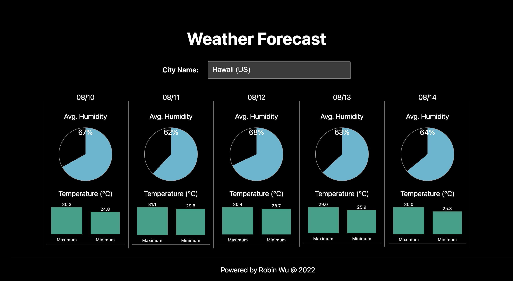

# Weather Forecast
This application is setup with Next.js, React.js, and SCSS, enjoy it!

## Getting Started
- Please use node v16 to run this application.
- Run the development server:
  ```bash
  yarn dev
  ```
- Open [http://127.0.0.1:3000](http://127.0.0.1:3000) with your browser to see the result.

## OpenWeather API
- [Call 5 day / 3 hour forecast data](https://openweathermap.org/forecast5)

## Snapshot

